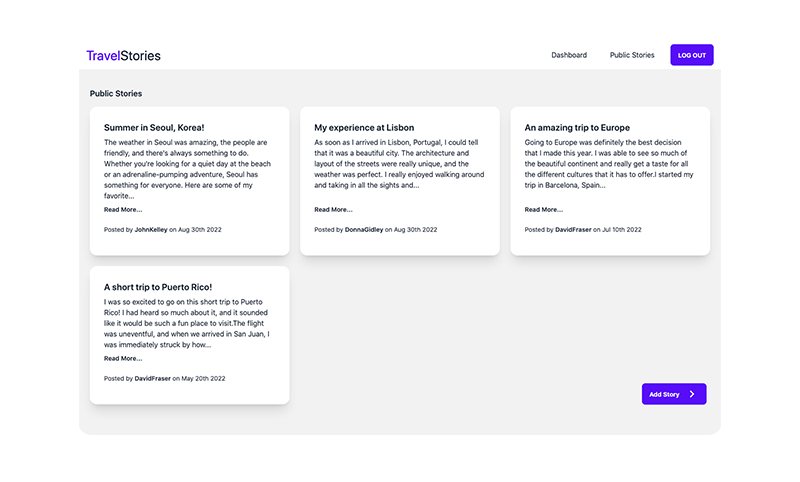

<div align="center">
  <h3 align="center">TravelStories</h3>
  <p align="center">
    A full stack application where users can share their recent travel stories and view other users' stories.
    <br />
    <br />
    <a href="">View</a>
    ·
    <a href="https://github.com/joselupianez/travelstories/issues">Report Bug</a>
    ·
    <a href="https://github.com/joselupianez/travelstories/pulls">Request Feature</a>
  </p>
  
</div>

<!-- TABLE OF CONTENTS -->
<details>
  <summary>Table of Contents</summary>
  <ol>
    <li>
      <a href="#how-its-made">How It's Made</a>
      <ul>
        <li><a href="#tech-used">Tech Used</a></li>
      </ul>
    </li>
    <li>
      <a href="#getting-started">Getting Started</a>
      <ul>
        <li><a href="#environment-variables">Environment Variables</a></li>
        <li><a href="#installation">Installation</a></li>
      </ul>
    </li>
    <li><a href="#optimizations">Optimizations</a></li>
    <li><a href="#lessons-learned">Lessons Learned</a></li>
  </ol>
</details>

## How It's Made:
The app was made NodeJS. The front end uses Handlebars to build semantic templates which we display to the users with data sent from the controller. In the backend we used MongoDB for the database, and ExpressJS for creating the web application. For the user authentication, the Passport middleware was used with the addition of bcryptjs for securing and hashing all passwords. 

### Tech Used:
[![JS][Javascript]][Javascript]
[![Tailwind][TailwindCSS]][TailwindCSS]
[![ExpressJS][Express.JS]][Express.JS]
[![NodeJS][Node.JS]][Node.JS]

<!-- GETTING STARTED -->
## Getting Started
### Environment Variables
The following environment variables are needed to run the application:

1. Port where the server will be ran
    ```
    PORT = 3000
    ```
2. Your MongoDB connection string
    ```
    MONGO_URI = INSERT URL
    ```
3. The database name on wish the data will be stored
    ```
    MONGO_DB = INSERT DATABASE NAME
    ```
4. The session secret used to hash the session
    ```
    SESSION_SECRET = INSERT RANDOM STRING
    ```

### Installation

1. Install NPM packages
    ```sh
    npm install
    ```
2. Start the development server
    ```sh
    npm run dev
    ```
3. Access server at [https://localhost:5000](https://localhost:5000)

## Optimizations

All user passwords are hashed using bcryptjs before storing them in the database. A relationship between the stories and users was added to prevent having to request data from the database multiple times. The application files are organized in their respective areas for easy change/addition in the future.

## Lessons Learned

By building the full-stack application with MVC in mind, when something needs to be fixed or added, it is easy to find where you need to go to do so. For example, if I wanted to change something related to the stories, I know that the changes would need to be made in the stories route or view. 

<!-- MARKDOWN LINKS & IMAGES -->
[Javascript]: https://img.shields.io/badge/javascript%20-%23323330.svg?&style=for-the-badge&logo=javascript&logoColor=%23F7DF1E
[TailwindCSS]: https://img.shields.io/badge/Tailwind_CSS-38B2AC?style=for-the-badge&logo=tailwind-css&logoColor=white
[Express.JS]: https://img.shields.io/badge/Express.js-404D59?style=for-the-badge
[Node.JS]: https://img.shields.io/badge/Node.js-43853D?style=for-the-badge&logo=node.js&logoColor=white

[screenshot]: screenshot.png